# DDR4 Timing Parameters Reference

This document describes every timing parameter in the `ddr4_timing_t` struct
(`ddr4_axi4_pkg.sv`) and explains how each is enforced inside the slave model
(`ddr4_axi4_slave.sv`).  Timing diagrams are rendered as SVG images by CI
(see [`.github/workflows/wavedrom.yml`](../.github/workflows/wavedrom.yml));
WaveDrom JSON sources live in [`docs/wavedrom/`](wavedrom/).

---

## Table of Contents

- [DDR4 Timing Parameters Reference](#ddr4-timing-parameters-reference)
  - [Table of Contents](#table-of-contents)
  - [1. Speed-grade value table](#1-speed-grade-value-table)
  - [2. Command-bus notation](#2-command-bus-notation)
  - [3. ACT→CAS latencies — tRCD, CL, CWL](#3-actcas-latencies--trcd-cl-cwl)
    - [tRCD — RAS to CAS Delay](#trcd--ras-to-cas-delay)
  - [4. Page-miss precharge — tRAS, tRP, tRC](#4-page-miss-precharge--tras-trp-trc)
    - [tRAS — Row Active Time (minimum)](#tras--row-active-time-minimum)
    - [tRP — Row Precharge Time](#trp--row-precharge-time)
    - [tRC — Row Cycle Time](#trc--row-cycle-time)
  - [5. Write recovery — tWR](#5-write-recovery--twr)
  - [6. Read-to-precharge — tRTP](#6-read-to-precharge--trtp)
  - [7. Write-to-read turnaround — tWTR\_S / tWTR\_L](#7-write-to-read-turnaround--twtr_s--twtr_l)
    - [tWTR\_L — different bank group](#twtr_l--different-bank-group)
    - [tWTR\_S — same bank group](#twtr_s--same-bank-group)
  - [8. CAS-to-CAS spacing — tCCD\_S / tCCD\_L](#8-cas-to-cas-spacing--tccd_s--tccd_l)
  - [9. Four-activate window — tFAW](#9-four-activate-window--tfaw)
  - [10. Refresh — tRFC, tREFI](#10-refresh--trfc-trefi)
    - [tREFI — Refresh Interval](#trefi--refresh-interval)
    - [tRFC — Refresh Cycle Time](#trfc--refresh-cycle-time)
  - [Timing diagram — full read transaction (page miss)](#timing-diagram--full-read-transaction-page-miss)
  - [Timing diagram — page-hit vs page-miss comparison](#timing-diagram--page-hit-vs-page-miss-comparison)

---

## 1. Speed-grade value table

All values are from JEDEC JESD79-4B.  `tCCD_S` / `tWTR_S` are in **nCK**
(number of clock cycles); everything else is in **ns** except `tCK` (ps)
and `CL` / `CWL` (nCK).

| Parameter | 1600 | 1866 | 2133 | 2400 | 2666 | 2933 | 3200 | Unit |
|-----------|-----:|-----:|-----:|-----:|-----:|-----:|-----:|------|
| **tCK**   | 1250 | 1071 |  937 |  833 |  750 |  682 |  625 | ps   |
| **CL**    |   11 |   13 |   15 |   17 |   19 |   21 |   22 | nCK  |
| **CWL**   |    9 |   10 |   11 |   12 |   14 |   16 |   16 | nCK  |
| **tRCD**  |   14 |   14 |   14 |   14 |   14 |   14 |   14 | ns   |
| **tRP**   |   14 |   14 |   14 |   14 |   14 |   14 |   14 | ns   |
| **tRAS**  |   35 |   34 |   33 |   32 |   32 |   32 |   32 | ns   |
| **tRC**   |   49 |   48 |   47 |   46 |   46 |   46 |   46 | ns   |
| **tWR**   |   15 |   15 |   15 |   15 |   15 |   15 |   15 | ns   |
| **tRTP**  |    8 |    8 |    8 |    8 |    8 |    8 |    8 | ns   |
| **tWTR_S**|    3 |    3 |    3 |    3 |    3 |    3 |    3 | nCK  |
| **tWTR_L**|  7.5 |  7.5 |  7.5 |  7.5 |  7.5 |  7.5 |  7.5 | ns   |
| **tFAW**  |   30 |   27 |   25 |   23 |   21 |   18 |   16 | ns   |
| **tCCD_S**|    4 |    4 |    4 |    4 |    4 |    4 |    4 | nCK  |
| **tCCD_L**|    5 |    5 |    5 |    5 |    6 |    6 |    6 | nCK  |
| **tRFC**  |  350 |  350 |  350 |  350 |  350 |  350 |  350 | ns   |
| **tREFI** | 7800 | 7800 | 7800 | 7800 | 7800 | 7800 | 7800 | ns   |

> **tWTR_S (ns)** = 3 nCK × tCK, e.g. at DDR4-3200: 3 × 0.625 = 1.875 ns.
> **tCCD_S** and **tWTR_S** are defined in nCK (clock cycles), not ns.

---

## 2. Command-bus notation

The waveforms below use four DDR4 command signals decoded from `{RAS_n, CAS_n, WE_n, CS_n}`:

| Label  | Meaning                                    |
|--------|--------------------------------------------|
| `ACT`  | Activate — opens a row in a bank           |
| `RD`   | Read CAS — issues a column read            |
| `WR`   | Write CAS — issues a column write          |
| `PRE`  | Precharge — closes the open row            |
| `REF`  | Auto-refresh                               |
| `.`    | NOP / deselect                             |

---

## 3. ACT→CAS latencies — tRCD, CL, CWL

### tRCD — RAS to CAS Delay

Minimum time from **ACT** (row activate) to the first **RD** or **WR** command
to the same bank.  Fixed at **14 ns** for all supported speed grades.

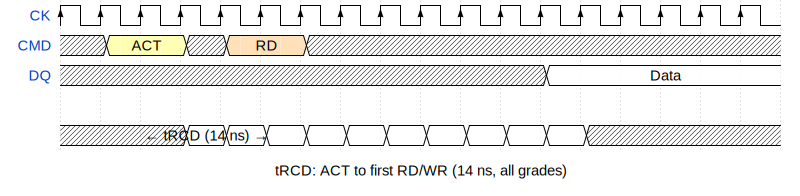

Annotated version with CL:

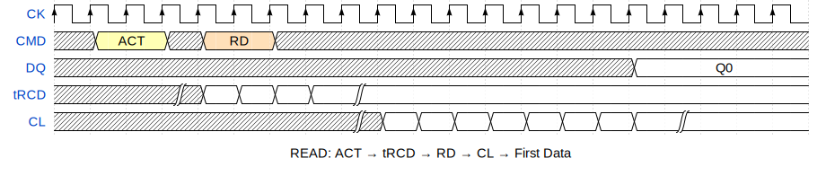

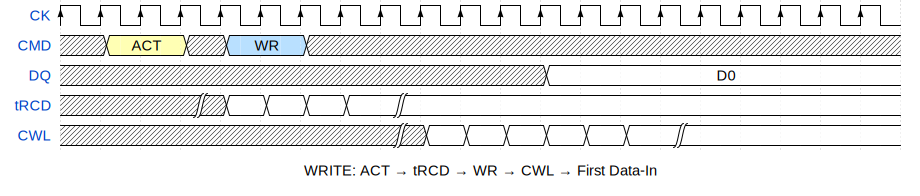

**Slave implementation** (`localparam`s):

```systemverilog
localparam int tRCD_CYC     = (14 * 1000 + TCK_PS - 1) / TCK_PS;
localparam int READ_LAT_CYC  = tRCD_CYC + CL_CYC;   // total read latency
localparam int WRITE_PRE_CYC = tRCD_CYC + CWL_CYC;  // total write latency
```

---

## 4. Page-miss precharge — tRAS, tRP, tRC

### tRAS — Row Active Time (minimum)

The row must remain active for at least **tRAS** after the ACT before a
**PRE** (precharge) command can be issued.

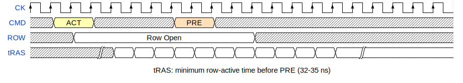

### tRP — Row Precharge Time

After **PRE**, the bank is unavailable for at least **tRP** before the next
**ACT**.

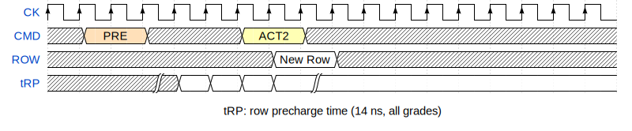

### tRC — Row Cycle Time

**tRC = tRAS + tRP** — the minimum interval between two consecutive **ACT**
commands to the *same bank*.  Not enforced by a separate counter; the tRAS
guard + tRP penalty in the page-miss path together guarantee it.

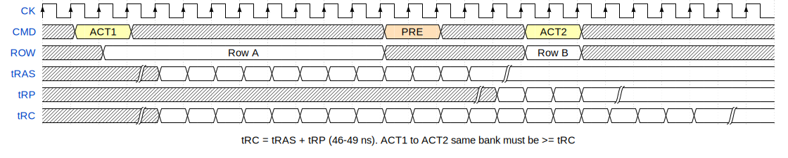

**Slave implementation** — page-miss stall:

```systemverilog
// 1) Wait until tRAS elapsed since last ACT
if (($time - bank_act_time[b_idx]) < time'(tRAS_NS))
    pen = pen + int'(time'(tRAS_NS) - ($time - bank_act_time[b_idx]))
              * 1000 / TCK_PS + 1;
// 2) Add tRP precharge penalty (automatically satisfies tRC = tRAS + tRP)
pen = pen + tRP_CYC;
```

---

## 5. Write recovery — tWR

After the last write **DQ** burst, the bank needs **tWR** before a **PRE**
can be issued (ensures data is fully absorbed into the row).

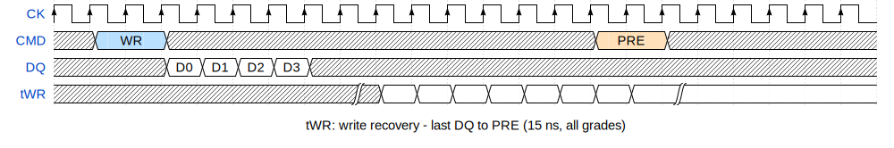

**Slave implementation**:

```systemverilog
localparam int tWR_CYC  = (15 * 1000 + TCK_PS - 1) / TCK_PS;
localparam int WRITE_REC_CYC = tWR_CYC;   // enforced in WR_RESP state
```

---

## 6. Read-to-precharge — tRTP

After the last **RD** CAS command, the bank must remain open for at least
**tRTP** before **PRE** can be issued.

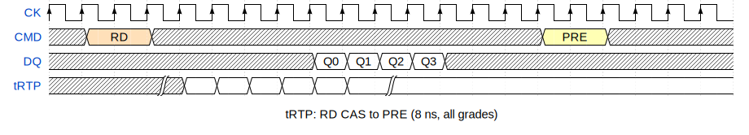

**Slave implementation**:

```systemverilog
localparam int tRTP_NS  = 8;
localparam int tRTP_CYC = (tRTP_NS * 1000 + TCK_PS - 1) / TCK_PS;

// In RD_IDLE page-miss branch:
if (($time - bank_last_rd_time[b_idx]) < time'(tRTP_NS))
    pen = pen + int'(time'(tRTP_NS) - ($time - bank_last_rd_time[b_idx]))
              * 1000 / TCK_PS + 1;
pen = pen + tRP_CYC;   // also enforces tRC
```

---

## 7. Write-to-read turnaround — tWTR_S / tWTR_L

After a write burst completes, the controller must wait before issuing a
**RD** command to avoid write-to-read data-bus conflicts.

- **tWTR_S** (same bank group) — shorter: **3 nCK**
- **tWTR_L** (different bank group) — longer: **max(4nCK, 7.5 ns)**

### tWTR_L — different bank group

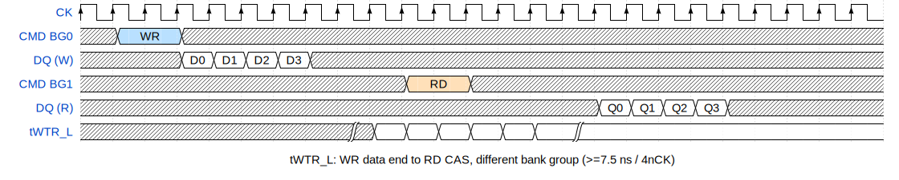

### tWTR_S — same bank group

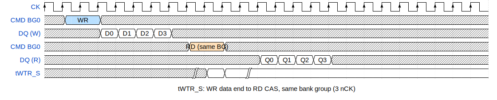

**Slave implementation**:

```systemverilog
localparam int tWTR_L_CYC    = (7500 + TCK_PS - 1) / TCK_PS;
localparam int tWTR_L_WIN_NS = (tWTR_L_CYC * TCK_PS + 999) / 1000;
localparam int tWTR_S_CYC    = 3;
localparam int tWTR_S_WIN_NS = (tWTR_S_CYC * TCK_PS + 999) / 1000;

// In RD_IDLE — select tWTR_S or tWTR_L based on bank group match:
int wtr_win_ns = (b_grp == last_wr_bank_grp) ? tWTR_S_WIN_NS : tWTR_L_WIN_NS;
int wtr_cyc    = (b_grp == last_wr_bank_grp) ? tWTR_S_CYC    : tWTR_L_CYC;
if (($time - last_write_done_time) < time'(wtr_win_ns))
    pen = pen + wtr_cyc;
```

---

## 8. CAS-to-CAS spacing — tCCD_S / tCCD_L

Consecutive **RD** or **WR** commands must be spaced by at least tCCD to
avoid data-bus collisions.

- **tCCD_S** (same bank group) — **4 nCK** (all grades)
- **tCCD_L** (different bank group) — **5 nCK** (≤2133) or **6 nCK** (≥2400)

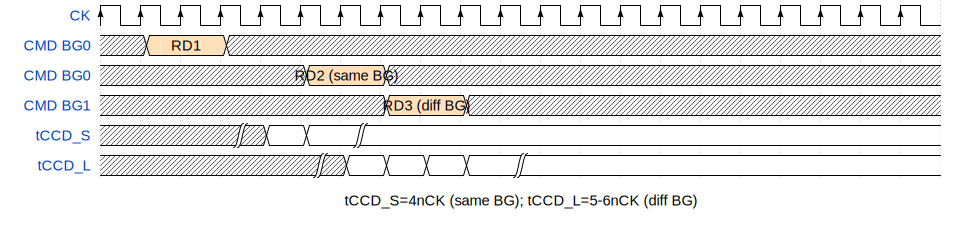

**Slave implementation**:

```systemverilog
localparam int tCCD_S_CYC = 4;
localparam int tCCD_L_CYC = (DDR4_SPEED_GRADE <= 2133) ? 5 : 6;

// In RD_IDLE / WR_IDLE — check last CAS time:
int ccd_gap = (b_grp == last_cas_bank_grp) ? tCCD_S_CYC : tCCD_L_CYC;
int ccd_ns  = (ccd_gap * TCK_PS + 999) / 1000;
if (($time - last_cas_time) < time'(ccd_ns))
    pen = pen + ccd_gap;
```

---

## 9. Four-activate window — tFAW

No more than **4 ACT** commands may be issued to any one rank within a
rolling **tFAW** window.  The limit prevents excessive current surges from
simultaneous row opens.

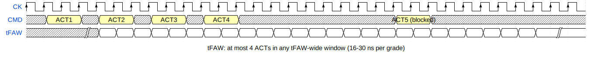

**Slave implementation** — ring buffer of the 4 most-recent ACT timestamps:

```systemverilog
localparam int tFAW_NS  = (DDR4_SPEED_GRADE == 1600) ? 30 :
                          (DDR4_SPEED_GRADE == 1866) ? 27 :
                          (DDR4_SPEED_GRADE == 2133) ? 25 :
                          (DDR4_SPEED_GRADE == 2400) ? 23 :
                          (DDR4_SPEED_GRADE == 2666) ? 21 :
                          (DDR4_SPEED_GRADE == 2933) ? 18 : 16;  // 3200
localparam int tFAW_CYC = (tFAW_NS * 1000 + TCK_PS - 1) / TCK_PS;

// Ring buffer faw_act_times[0:3]; faw_head; faw_entry_count.
// Before every ACT, if 4 entries recorded and oldest still within tFAW_NS,
// stall until that entry expires, then evict and insert.
```

---

## 10. Refresh — tRFC, tREFI

### tREFI — Refresh Interval

The memory controller must issue one **REF** command at least every
**7800 ns** (64 ms / 8192 rows).

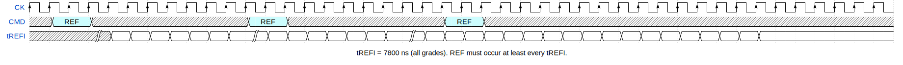

### tRFC — Refresh Cycle Time

After **REF**, all banks are locked out for **350 ns** (8 Gb device).
All commands during this window are stalled.

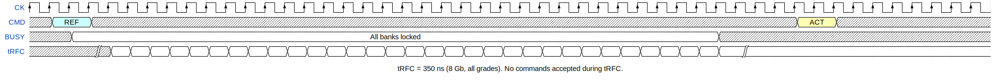

**Slave implementation**:

```systemverilog
localparam int tRFC_CYC  = (350 * 1000 + TCK_PS - 1) / TCK_PS;
localparam int tREFI_NS  = 7800;   // used as $time comparison in ns

// Scheduler: next_refresh_time += tREFI_NS each interval.
// When $time >= next_refresh_time, stall for tRFC_CYC cycles before proceeding.
```

---

## Timing diagram — full read transaction (page miss)

The following shows the complete sequence for a **read on a closed row**,
combining tRAS, tRP, tRCD, and CL:

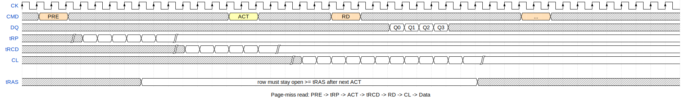

---

## Timing diagram — page-hit vs page-miss comparison

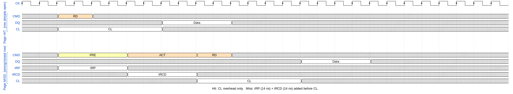

---

*Source values: JEDEC Standard No. 79-4B (DDR4 SDRAM), Table 24.*
*Localparam names refer to `ddr4_axi4_slave.sv`.*
